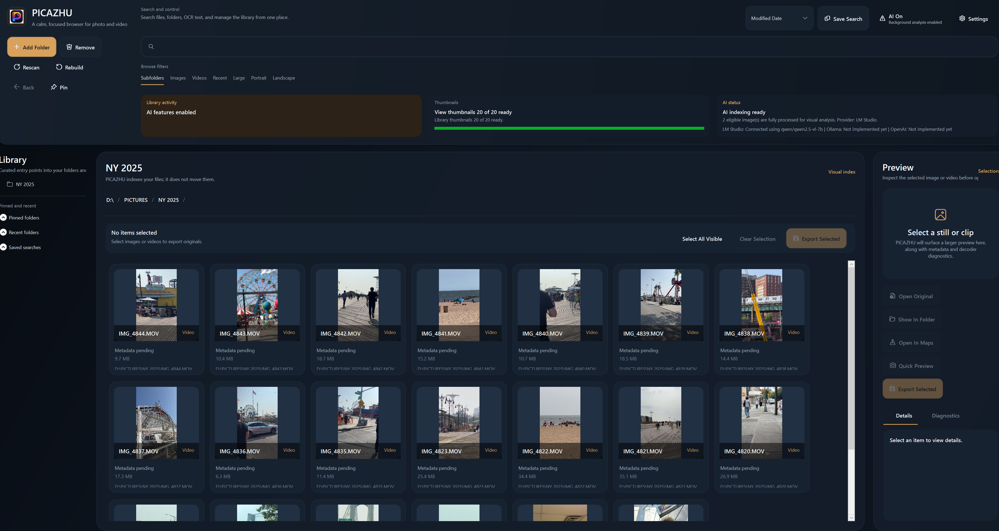
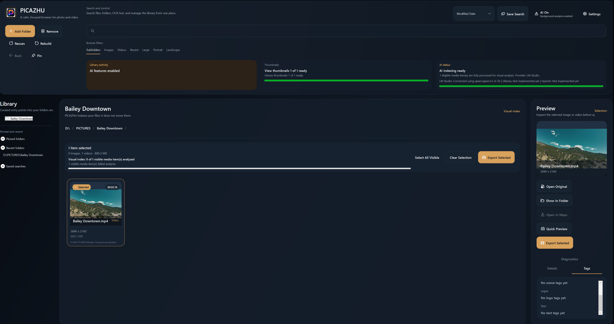

# PICAZHU for Windows

Premium local-first media browsing for Windows.

Fast. Visual. Private. Built for real folders.


PICAZHU for Windows is the Windows desktop companion to the PICAZHU media browser. It lets you browse, inspect, search, import, and export photos and videos using real folders on your PC. No cloud library. No lock-in. No file takeover.

Point it at a folder, scan subfolders, preview media, inspect metadata, find files by name or AI tags, and export selected originals for printing, sharing, or client delivery.

## Screenshots



The main workspace is built around a media-first gallery, folder navigation, live indexing status, optional AI status, and a right-side preview rail.



PICAZHU supports visual video cards, selected-media export, preview actions, metadata, diagnostics, and AI tag inspection from the same workspace.

## Why PICAZHU Exists

Managing visual media should not feel like fighting a catalog system. PICAZHU is designed for photographers, videographers, creators, and anyone with large folders of images and clips who wants a fast, calm way to review files directly from the filesystem.

The Windows app keeps the core product idea simple:

- Your filesystem stays the source of truth.
- Originals are not moved unless you explicitly import/export copies.
- AI is optional and off by default.
- Local performance matters more than background magic.

## What PICAZHU Does

PICAZHU indexes your real folders into a local SQLite catalog, generates thumbnails, extracts metadata, and presents everything in a modern Windows desktop shell. It also includes a PC-friendly iPhone import workflow for copying original camera media into a local folder and indexing it immediately.

## Key Features

### Visual Media Browser

- Folder-first library built from real filesystem roots.
- Recursive subfolder indexing for large photo/video libraries.
- Virtualized visual grid for large result sets.
- Preview rail with metadata, diagnostics, and AI tags.
- Breadcrumb navigation, pinned folders, recent folders, and saved searches.
- Search by file name, folder path, metadata, OCR text, and AI analysis text.
- Filters for images, videos, recent files, large files, portrait, and landscape.
- Responsive media-first shell for full-screen and restored windows.
- Runtime light/dark theme switching with tested dynamic theme resources.

### Import and Export

- Multi-select media workflow with keyboard and mouse.
- Export selected originals into a folder you choose.
- Right-click context menu for selection, preview, open original, show in folder, and export.
- iPhone import through Windows portable-device access.
- Visual iPhone import picker with larger thumbnails and selection badges.
- Supports classic `DCIM` and newer `Internal Storage\YYYYMM_a` iPhone camera folder layouts.
- Skips exact duplicate imports and auto-renames non-duplicate conflicts.

### HEIC and Media Support

- HEIC support uses a decoder abstraction:
  - Windows WIC/HEIF decoder when available and healthy.
  - Bundled libheif fallback when Windows codecs are missing or broken.
  - Clear diagnostics if no decoder path is available.
- Image and video thumbnail generation.
- Video quick preview support.
- AppleDouble sidecar files such as `._IMG_0001.HEIC` are ignored.

### Optional AI Layer

AI is optional and starts off by default for maximum performance.

Current implemented AI capabilities:

- Runtime AI kill switch.
- Provider status visibility in the header.
- Settings-driven provider selection for LM Studio, Ollama, Ollama Cloud, and OpenAI vision.
- Local LM Studio and Ollama visual tagging paths.
- OpenAI and Ollama Cloud remote vision tagging paths when API keys are configured.
- OCR extraction for searchable visible text.
- Tags tab for selected media.
- Visual analysis progress indicators.

Current open AI areas:

- Embeddings and hybrid semantic ranking are not complete yet.
- Cloud/local provider paths need broader live QA across user-owned keys, endpoints, and model catalogs.

## Requirements

- Windows 10 or Windows 11, x64.
- .NET 8 Desktop Runtime for framework-dependent builds.
- Optional: LM Studio with a vision-capable local model for AI tagging.
- Optional: Ollama with a vision-capable local model such as `gemma3`, `llama3.2-vision`, or `llava`.
- Optional: OpenAI API key or Ollama Cloud API key for remote vision tagging.
- Optional: iPhone connected by USB, unlocked, and trusted for iPhone import.

## Install

Download the latest Windows release from GitHub Releases:

- `PICAZHU-Windows-Setup-0.1.2-alpha.exe`
- `PICAZHU-Windows-portable-0.1.2-alpha.zip`

The setup installer is the recommended path for normal users. The portable zip is useful for testing.

Note: early alpha installers may be unsigned. Windows SmartScreen can warn on unsigned apps until a code-signing certificate is added.

## Security Note

The `0.1.2-alpha` installer is unsigned. Windows may show an `Unknown publisher` or SmartScreen warning until PICAZHU is signed with an OV/EV code-signing certificate.

For this release:

- Verify downloads against `SHA256SUMS.txt`.
- Scan the installer or portable zip with your antivirus before installing if your environment requires it.
- The published `0.1.2-alpha` release folder was scanned locally with Microsoft Defender on May 11, 2026, and Defender reported no threats.

Antivirus scans are a useful distribution check, but they are not a substitute for code signing. A signed installer is still required for a stronger public trust signal.

## Quick Start

1. Launch PICAZHU.
2. Click `Add folder`.
3. Choose whether to scan subfolders.
4. Browse the visual grid.
5. Select media to preview, inspect metadata, export originals, or run AI analysis.

For iPhone import:

1. Connect the iPhone by USB.
2. Unlock the iPhone and tap `Trust This Computer`.
3. Click `Import from iPhone`.
4. Refresh devices, scan camera media, select tiles, choose a destination, and import.

## Build From Source

```powershell
git clone https://github.com/ablakateam/picazhu-windows.git
cd picazhu-windows

dotnet restore .\Picazhu.sln
dotnet build .\Picazhu.sln -c Release -m:1
dotnet test .\Picazhu.sln -c Release --no-build -m:1
dotnet run --project .\app\Picazhu.App\Picazhu.App.csproj -c Release
```

Publish the app:

```powershell
dotnet publish .\app\Picazhu.App\Picazhu.App.csproj `
  -c Release `
  -r win-x64 `
  --self-contained false `
  -m:1 `
  -o .\publish\Picazhu.App-win-x64
```

Build release assets:

```powershell
.\scripts\Build-WindowsRelease.ps1
```

The installer build requires Inno Setup 6:

```powershell
winget install --id JRSoftware.InnoSetup --accept-package-agreements --accept-source-agreements
```

## Architecture

```text
PICAZHU/
├── app/
│   ├── Picazhu.App       # WPF shell, windows, view models, visual layout
│   ├── Picazhu.Core      # domain models, interfaces, media/search helpers
│   ├── Picazhu.Data      # SQLite repository, settings, export, iPhone import
│   ├── Picazhu.Indexing  # folder scanner, metadata queue, thumbnail queue
│   ├── Picazhu.Media     # metadata probing, HEIC decoder, quick preview
│   ├── Picazhu.Cache     # app paths and thumbnail cache
│   ├── Picazhu.AI        # AI gate, OCR, LM Studio/OpenAI/Ollama scaffolding
│   └── Picazhu.Tests     # regression tests
├── installer/            # Inno Setup installer definition
├── scripts/              # build, recovery, and release scripts
├── tools/                # developer utilities
├── docs/screenshots      # public README screenshots
└── docs/status files
```

## Local Data

PICAZHU stores local runtime state under:

```text
%LocalAppData%\Picazhu
```

This includes the SQLite catalog, thumbnails, logs, temp files, and AI cache data. These are user-local runtime files and should not be committed to source control.

## Recovery Tools

```powershell
.\scripts\Clear-ThumbnailCache.ps1
.\scripts\Rebuild-Catalog.ps1
```

`Rebuild-Catalog.ps1` removes the local catalog and thumbnail cache so PICAZHU can rebuild from watched roots.

## Current Status

This repository is currently alpha-quality but functional for controlled testing.

Verified in the latest local build:

- Release build succeeds.
- Automated tests pass.
- Published executable starts and responds.
- Native Windows installer builds with Inno Setup.
- Portable release zip and SHA-256 checksums are generated.
- iPhone import detects a real iPhone, scans camera folders, and downloads thumbnails.
- HEIC fallback architecture is in place.
- Runtime light/dark theme switching is backed by dynamic theme resources and regression tests.

See:

- `STATUS.md`
- `PROGRESS.md`
- `DISTRIBUTION.md`
- GitHub Wiki: https://github.com/ablakateam/picazhu-windows/wiki

## Roadmap

- Signed Windows installer.
- GitHub Actions release automation.
- More iPhone real-device QA.
- More HEIC sample validation.
- OpenAI/Ollama provider completion.
- Embeddings and hybrid semantic ranking.
- Richer video AI summaries.
- Auto-update support.

## Related

- macOS PICAZHU repo: https://github.com/ablakateam/picazhu

## License

Proprietary. All rights reserved.
